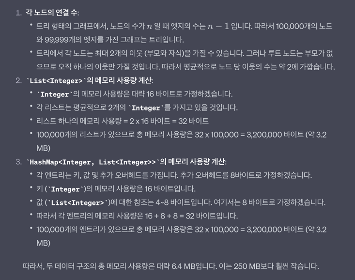
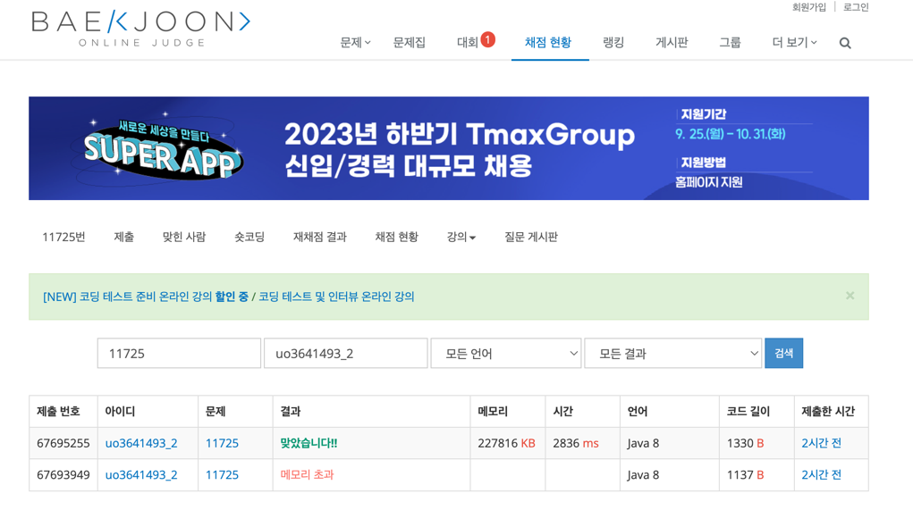
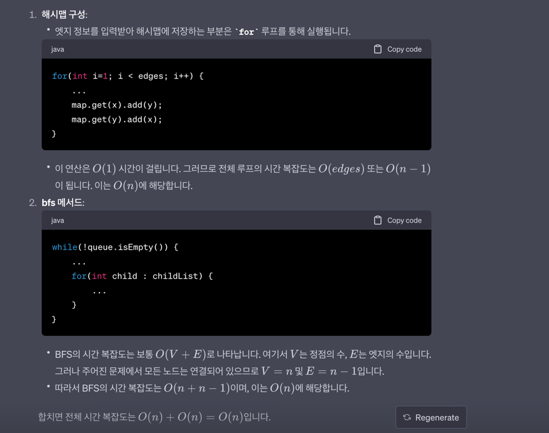
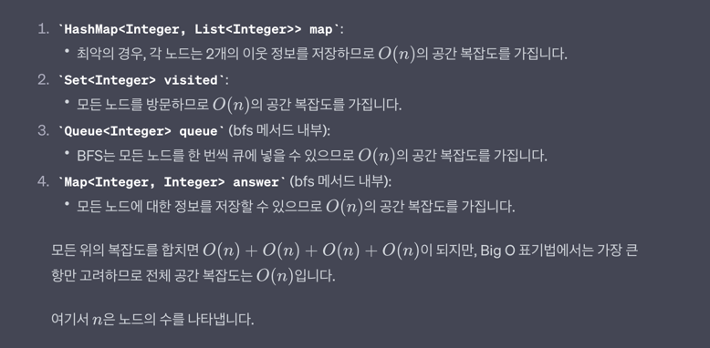

## 11725번 문제 - 트리의 부모 찾기

 

### 풀이
1. 처음에는 문제 자체가 이해가 되지 않았다.
2. 다른 블로그를 몇 개 참고해보니 2번 노드부터 각 노드의 부모 노드의 번호를 그냥 출력하면 되는 문제였다.
3. 이때 'dfs'나 bfs로 했을 경우나 여러 자식 노드를 가질 경우 탐색의 순서가 바뀔 수 있을 때에는 부모 노드가 달라지지 않을까?'라는 고민이 들긴 했지만, 1번 예제 케이스의 경우에는 동일했다.
   * 아직도 여전히 의문은 있고, 추후에 공부 해봐야겠다.
4. 개인적으로는 재귀를 사용하는 dfs보다는 재귀를 사용하지 않는 bfs가 편하다고 느꼈기 때문에 bfs로 풀기로 생각했다.
5. 연결된 정점(vertices)를 찾기 위해 이중 배열 사용을 사용하려 했으나, 노드의 최대 개수가 100,000개이기 때문에 메모리 초과 이슈가 생겼다.
   * 노드의 최대 개수라고 가정하면 이중 배열이 int[100001][100001]인데 이게 몇 MB(문제에서는 250MB 제한)를 차지할까 궁금했다.
   * ChatGPT를 찾아보니 40GB의 메모리가 필요하다고 한다.🥲
6. 이를 해결하기 위해 테이블이 아닌 방법을 고민해보다가 '체이닝 해시테이블을 사용해보면 괜찮지 않을까?'라고 생각했다.
   * 체이닝 해시테이블을 사용하게 된다면, 테이블을 굳이 만들지 않아도 되기 때문에 메모리가 훨씬 적게 사용될 것으로 생각했다.
   * 사실, 체이닝 해시테이블의 메모리 용량을 고려하지 않았지만, 한 번에 통과 되었다.
   * 이에 대한 궁금증이 생겨서 체이닝 해시테이블(HashMap<Integer, List<Integer>)이 가지는 메모리 용량을 계산하려고 했으나 맞는지 확실치 않아서 ChatGPT를 사용했다.
      
   * 위와 같은 방식으로 계산 해보면, 메모리는 그렇게 높지 않다는 것인데, 이해가 가지 않았던 것은 백준에서 메모리가 227816KB(약 227MB)가 나왔다는 것이다.
      
   * 모든 테스트 케이스에 대한 전체 메모리 용량인 것 같기도 한데, 이게 왜 이렇게 나왔는지는 추후에 찾아볼 예정이다. 
7. 연결된 정점 중에 이미 방문한 정점(vertex)을 찾지 않기 HashSet을 사용하기로 했다.
   * 노드의 개수에 따라서 HashSet의 크기가 좌우 되겠지만, 이 역시도 최고 많은 노드가 100,000개이기 때문에 그렇게 큰 메모리를 차지하지 않을 것으로 생각한다.
8. 2번째 노드부터 마지막 노드까지 차례대로 부모 노드의 번호를 출력해야 했기 때문에 TreeMap을 사용했다.

### 복잡도(vertices : n개, edges : m(=n-1))
* 시간복잡도 : O(n)
  
* 공간복잡도 : O(n)
  
