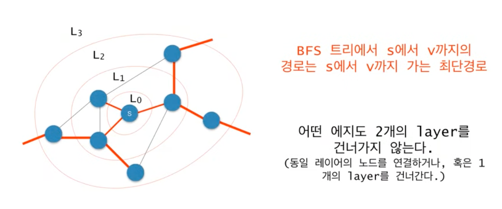

## 2178번 문제 - 미로 탐색

 

### 풀이
1. 이 문제도 역시나 문제의 의도를 파악하지 못해서 중간에 코드를 갈아 엎었다.
2. 처음에는 bfs 알고리즘으로 동, 서, 남, 북 중에 길이 하나라도 있으면 flag 변수를 사용해서 길을 하나씩 카운트 했다.
3. 하지만, 문제는 최소한의 길의 개수를 요구 했기 때문에, 위의 코드로는 양갈래가 나오면 최소한의 길을 보장할 수 없었다.
4. 이후 산책을 하면서 어떻게 구현할지 고민했다.
5. 먼저, 직접 예제 2번을 가지고 (0,0) 위치에서 갈 수 있는 길로 한 칸씩 이동하면서 지금까지 이동한 개수를 손으로 직접 그려봤다.
6. 손으로 직접 그려보니, 동, 서, 남, 북 중에 갈 수 있는 길이 존재한다면, 움직인 위치의 이동한 개수는 현재 위치의 이동한 개수에서 1칸 더 간 것이라고 판단했다.
7. 이동한 개수를 이중배열 자료구조로 만들어서 이동할 수 있는 인접한 위치의 값은 현재 위치의 값보다 하나씩 더했다.
8. 이를 보면서 약간 dp 같다는 생각을 하기도 했고, 혹은 [알고리즘 제 14-2강 그래프에서의 BFS](https://www.youtube.com/watch?v=O7pDLEMsiBs&list=PL52K_8WQO5oUuH06MLOrah4h05TZ4n38l&index=31) 강의에서 설명한 그림이랑 비슷하다는 생각을 했다.
   * 
9. 다행히 좌측 상단에서 시작해서 우측 하단으로 이동하는 것만 고려했기 때문에 위의 알고리즘으로도 문제가 없었던 것 같다. 

### 복잡도(vertices : n개, edges : m개 - n은 x축의 개수와 y축의 개수의 곱 연산이며, m은 일일히 세어 봐야 하지만 인접한 동, 서, 남, 북으로 인접한 두 값이 모두 1인 개수를 의미)
* 시간복잡도 : O(m)
* 공간복잡도 : O(n)
